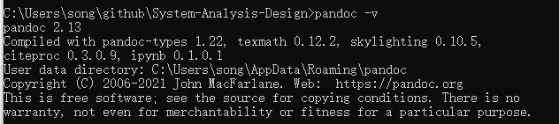

### 格式要求
#### 标题格式：
* 标题1：黑体、三号居中
* 标题2：黑体四号居左
* 标题3：黑体小四居左
* 标题4：黑体五号居左

**注：由于老师所给模板中有不在上述标题格式中的项目名称和作业名称，特将其分别作为五级标题和六级标题**

#### 段落要求：单倍行距，段前0.5行、段后0.5行
#### 文字格式：首行缩进，宋体五号，单倍行距
#### 图表格式：图、表均需有图题、表题，包括编号、名称。采用小5号宋体加粗，居中，编号按照章节编排，如图1-1、图2-1这种形式
**所有的英文字体都采用Times New Roman**
### 使用说明
#### 编写与预览
1. 打开typora->文件->偏好设置->外观->主题->打开主题文件夹
2. 将sys-analysis-design.css复制到主题文件夹下
3. 关闭并重新打开typora，点击主题->选择Sys Analysis Design

**在该主题下编写所见即为所需格式要求**

#### 导出
1. 若尚未安装pandoc则先按照typora的提示安装pandoc
2. 命令行中通过pandoc -v的提示信息找到User data directory
3. 将reference.docx文件复制到该文件夹下（注：该文件夹可能尚未存在，需要手动创建）
4. 重启程序即可使用导出功能

**test文件夹内有test.md以及导出的word版本供参考**

---

**对于导出的word文档的表格列宽问题，可以使用pandoc命令行option`pandoc --from=markdown+multiline_tables source.md -o source.docx`**

